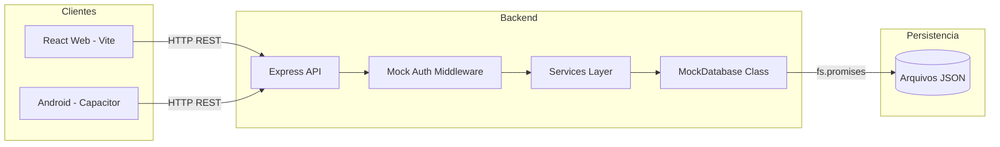
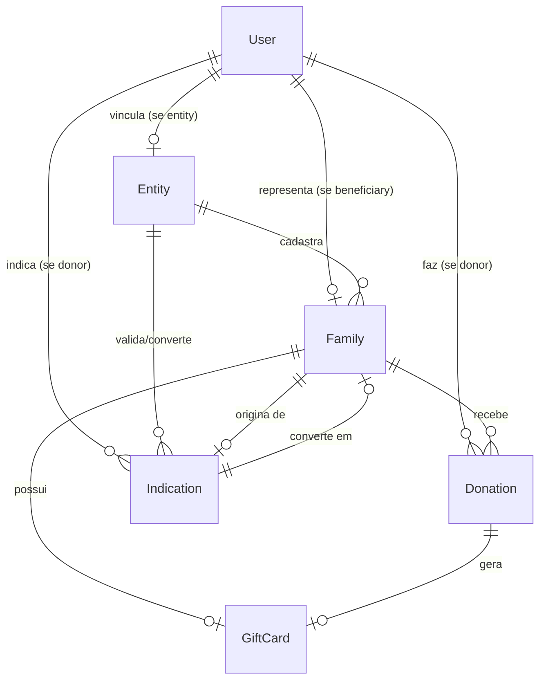

# CRUD e Arquitetura do Banco de Dados - Backend Mealfy

**Documento:** Documentação técnica da arquitetura real
**Data:** 2026-06-11
**Estado Atual:** Mock com persistência em arquivos JSON

---

## 1. VISÃO GERAL

### 1.1 Responsabilidade do Backend

O backend Mealfy atua como API REST para o ecossistema de doações alimentares, servindo:
- **Web App React** (Vite)
- **Mobile App** (Capacitor/Android)

### 1.2 Fluxo de Dados

```
┌─────────────┐     ┌─────────────┐     ┌─────────────┐
│  React Web  │────▶│  Express    │────▶│   Arquivos  │
│  (Vite)     │     │  API REST   │     │   JSON      │
└─────────────┘     └─────────────┘     └─────────────┘
       │                   │                   │
       │                   ▼                   │
       │           ┌─────────────┐              │
       │           │  Mock Auth │              │
       │           │  (Header)  │              │
       │           └─────────────┘              │
       │                                          │
       ▼                                          ▼
┌─────────────┐                           ┌─────────────┐
│  Android   │                           │   Mock      │
│  (Capacitor)│                           │ Database    │
└─────────────┘                           └─────────────┘
```

**Nota:** Implementação atual é MOCK. Não há PostgreSQL, Prisma ou Firebase.

### 1.3 Autenticação

**Mock Authentication via Header:**
```http
x-user-id: admin-1
```

ou

```http
Authorization: Bearer admin-1
```

O middleware busca o ID diretamente no arquivo `users.json`.

### 1.4 Organização dos Módulos

```
src/
├── modules/
│   ├── auth/           # Registro, login mock
│   ├── admin/          # Gestão administrativa
│   ├── donations/      # Doações individuais, batch e regionais
│   ├── families/       # CRUD de famílias
│   ├── indications/    # Indicações de doadores
│   ├── ranking/        # Ranking de doadores
│   └── regions/        # Agregação por região
└── shared/
    ├── middlewares/    # Auth, roleGuard, errorHandler
    ├── types/          # Interfaces TypeScript
    └── utils/          # Funções utilitárias
```

### 1.5 Tratamento de Erros

```typescript
// AppError - Erros customizados
class AppError {
  message: string;
  statusCode: number;
}

// Resposta padrão de erro
{
  "status": "error",
  "message": "Error message"
}
```

---

## 2. DIAGRAMA DA ARQUITETURA



---

## 3. ARQUITETURA DAS TABELAS (Arquivos JSON)

### 3.1 users.json

**Propósito:** Armazena usuários de todos os perfis.

| Campo | Tipo | Obrigatório | Único | Padrão | Descrição |
|-------|------|-------------|-------|--------|-----------|
| id | string | Sim | Sim | Gerado | Identificador único |
| name | string | Sim | Não | - | Nome completo |
| email | string | Sim | Sim | - | Email |
| role | enum | Sim | Não | - | donor, entity, beneficiary, admin |
| status | enum | Não | Não | active | pending, approved, rejected, active, suspended |
| entityId | string | Não | Não | - | FK para entities (se role=entity) |
| beneficiaryId | string | Não | Não | - | FK para families (se role=beneficiary) |
| phone | string | Não | Não | - | Telefone |
| documentType | enum | Não | Não | - | cpf ou cnpj |
| documentNumber | string | Não | Não | - | Número do documento |
| totalDonated | number | Sim | Não | 0 | Total doado em reais |
| privacySettings | object | Não | Não | Ver abaixo | Configurações de privacidade |
| impactPreferences | object | Não | Não | - | Preferências de impacto |

**privacySettings:**
| Campo | Tipo | Padrão |
|-------|------|--------|
| showOnRanking | boolean | true |
| showInstagram | boolean | false |
| anonymousMode | boolean | false |

### 3.2 entities.json

**Propósito:** Dados complementares das organizações.

| Campo | Tipo | Obrigatório | Único | Padrão | Descrição |
|-------|------|-------------|-------|--------|-----------|
| id | string | Sim | Sim | Gerado | Identificador |
| name | string | Sim | Não | - | Nome da organização |
| cnpj | string | Sim | Sim | - | CNPJ |
| region | string | Sim | Não | - | Região de atuação |
| type | enum | Sim | Não | - | ONG, igreja, escola, instituto |
| responsibleName | string | Sim | Não | - | Nome do responsável |
| email | string | Sim | Não | - | Email comercial |
| phone | string | Sim | Não | - | Telefone |
| addressOrDistrict | string | Não | Não | - | Endereço |
| websiteOrInstagram | string | Não | Não | - | Website/Rede social |
| shortDescription | string | Não | Não | - | Descrição |
| status | enum | Sim | Não | pending | pending, approved, rejected |
| createdAt | string | Sim | Não | ISO Date | Data de criação |

### 3.3 families.json

**Propósito:** Famílias beneficiárias cadastradas.

| Campo | Tipo | Obrigatório | Único | Padrão | Descrição |
|-------|------|-------------|-------|--------|-----------|
| id | string | Sim | Sim | Gerado | Identificador |
| representativeName | string | Sim | Não | - | Nome do representante |
| region | string | Sim | Não | - | Região/Bairro |
| childrenCount | number | Sim | Não | - | Quantidade de filhos |
| status | enum | Sim | Não | pending | pending, approved, rejected, suspended |
| supportStatus | enum | Sim | Não | needs_help | needs_help, fed, rejected, suspended |
| lastFedAt | string | Não | Não | - | Data última doação |
| createdByEntityId | string | Não | Não | - | FK entidade que cadastrou |
| sourceType | enum | Sim | Não | - | entity ou donor_indication |
| sourceLabel | string | Sim | Não | - | Label de origem |
| originalIndicationId | string | Não | Não | - | FK indicação original |
| latitude | number | Sim | Não | - | Latitude |
| longitude | number | Sim | Não | - | Longitude |

### 3.4 indications.json

**Propósito:** Indicações de famílias feitas por doadores.

| Campo | Tipo | Obrigatório | Único | Padrão | Descrição |
|-------|------|-------------|-------|--------|-----------|
| id | string | Sim | Sim | Gerado | Identificador |
| representativeName | string | Sim | Não | - | Nome do representante |
| region | string | Sim | Não | - | Região |
| childrenCount | number | Sim | Não | - | Quantidade de filhos |
| observation | string | Sim | Não | - | Observação |
| indicatedByUserId | string | Sim | Não | - | FK usuário que indicou |
| status | enum | Sim | Não | pending | pending, approved, rejected, converted |
| createdAt | string | Sim | Não | ISO Date | Data de criação |

### 3.5 donations.json

**Propósito:** Registro de doações realizadas.

| Campo | Tipo | Obrigatório | Único | Padrão | Descrição |
|-------|------|-------------|-------|--------|-----------|
| id | string | Sim | Sim | Gerado | Identificador |
| donorId | string | Sim | Não | - | FK usuário doador |
| familyId | string | Sim | Não | - | FK família beneficiada |
| amount | number | Sim | Não | Calculado | Valor em reais |
| createdAt | string | Sim | Não | ISO Date | Data da doação |

### 3.6 giftcards.json

**Propósito:** Vouchers gerados para famílias.

| Campo | Tipo | Obrigatório | Único | Padrão | Descrição |
|-------|------|-------------|-------|--------|-----------|
| id | string | Sim | Sim | Gerado | Identificador |
| donationId | string | Sim | Não | - | FK doação |
| provider | enum | Sim | Não | ifood | ifood ou other |
| code | string | Sim | Sim | Gerado | Código do voucher |
| amount | number | Sim | Não | - | Valor em reais |
| status | enum | Sim | Não | generated | generated, delivered, used |
| createdAt | string | Sim | Não | ISO Date | Data de criação |

### 3.7 audit-logs.json

**Propósito:** Log de eventos críticos.

| Campo | Tipo | Obrigatório | Descrição |
|-------|------|-------------|-----------|
| id | string | Sim | Identificador |
| timestamp | string | Sim | Data/hora ISO |
| type | string | Sim | Tipo do evento |
| *demais campos | any | Não | Dados específicos do evento |

---

## 4. DIAGRAMA ENTIDADE-RELACIONAMENTO



---

## 5. CRUD POR ENTIDADE

### 5.1 Usuários

#### Criar Doador
- **Operação:** Criar
- **Método:** `POST`
- **Rota:** `/auth/register/donor`
- **Roles:** Público
- **Payload:**
  ```json
  {
    "name": "João Silva",
    "email": "joao@email.com",
    "documentType": "cpf",
    "documentNumber": "12345678901"
  }
  ```
- **Validações:**
  - name >= 3 caracteres
  - email válido e único
  - documentNumber >= 11 caracteres
- **Tabelas:** users
- **Resposta:** 201 + User object
- **Erros:** 409 (email duplicado)

#### Criar Entidade
- **Operação:** Criar
- **Método:** `POST`
- **Rota:** `/auth/register/entity`
- **Roles:** Público
- **Payload:**
  ```json
  {
    "name": "ONG Esperança",
    "email": "contato@ong.org",
    "cnpj": "12345678000199",
    "region": "Heliópolis",
    "type": "ONG"
  }
  ```
- **Validações:**
  - name >= 3 caracteres
  - email válido e único
  - cnpj >= 14 caracteres
  - region >= 3 caracteres
- **Tabelas:** users, entities
- **Resposta:** 201 + User object (status=pending)
- **Erros:** 409 (email duplicado)

#### Login Mock
- **Operação:** Autenticar
- **Método:** `POST`
- **Rota:** `/auth/login/mock`
- **Roles:** Público
- **Payload:**
  ```json
  {
    "email": "doador@mealfy.com",
    "password": "any"
  }
  ```
- **Tabelas:** users
- **Resposta:**
  ```json
  {
    "token": "donor-1",
    "user": { ... }
  }
  ```
- **Erros:** 401 (credenciais inválidas)

#### Obter Perfil
- **Operação:** Ler
- **Método:** `GET`
- **Rota:** `/auth/me`
- **Roles:** Autenticado
- **Tabelas:** users (via middleware)
- **Resposta:** User object

#### Atualizar Preferências
- **Operação:** Atualizar
- **Método:** `PATCH`
- **Rota:** `/auth/me/preferences`
- **Roles:** Doador
- **Payload:**
  ```json
  {
    "preferredRegion": "Heliópolis"
  }
  ```
- **Tabelas:** users
- **Resposta:** User object atualizado

### 5.2 Famílias

#### Listar Públicas
- **Operação:** Listar
- **Método:** `GET`
- **Rota:** `/families/public`
- **Roles:** Público
- **Query Params:** region, communityId
- **Filtros:**
  - status = approved
  - supportStatus NOT IN (rejected, suspended)
- **Tabelas:** families
- **Resposta:** Family[]

#### Obter por ID
- **Operação:** Ler
- **Método:** `GET`
- **Rota:** `/families/:id`
- **Roles:** Autenticado
- **Tabelas:** families
- **Resposta:** Family object
- **Erros:** 404 (não encontrado)

#### Criar Família
- **Operação:** Criar
- **Método:** `POST`
- **Rota:** `/families`
- **Roles:** entity (approved), admin
- **Payload:**
  ```json
  {
    "representativeName": "Maria Silva",
    "neighborhood": "Heliópolis",
    "city": "São Paulo",
    "state": "SP",
    "shortAddress": "Rua A, 123",
    "description": "Família necessitada",
    "childrenCount": 3,
    "mainNeed": "Alimentação básica",
    "latitude": -23.612,
    "longitude": -46.593
  }
  ```
- **Validações:**
  - representativeName >= 3 chars
  - neighborhood >= 3 chars
  - childrenCount >= 1
- **Tabelas:** families
- **Resposta:** 201 + Family object
- **Erros:** 403 (entidade pendente)

#### Atualizar Status
- **Operação:** Atualizar
- **Método:** `PATCH`
- **Rota:** `/families/:id/status`
- **Roles:** admin
- **Payload:**
  ```json
  {
    "status": "approved",
    "supportStatus": "needs_help"
  }
  ```
- **Tabelas:** families
- **Resposta:** Family object

### 5.3 Indicações

#### Criar Indicação
- **Operação:** Criar
- **Método:** `POST`
- **Rota:** `/indications`
- **Roles:** donor
- **Payload:**
  ```json
  {
    "representativeName": "Maria Oliveira",
    "region": "Paraisópolis",
    "childrenCount": 2,
    "observation": "Família em situação vulnerável"
  }
  ```
- **Tabelas:** indications
- **Resposta:** 201 + Indication object

#### Listar Indicações
- **Operação:** Listar
- **Método:** `GET`
- **Rota:** `/indications`
- **Roles:** entity, admin
- **Tabelas:** indications
- **Resposta:** Indication[]

#### Converter em Família
- **Operação:** Converter
- **Método:** `POST`
- **Rota:** `/indications/:id/convert`
- **Roles:** entity (approved), admin
- **Tabelas:** indications, families
- **Transação:** Não (mock)
- **Resposta:** 201 + Family object
- **Erros:**
  - 404 (indicação não encontrada)
  - 409 (já convertida)
  - 403 (entidade pendente ou região incompatível)

#### Atualizar Status
- **Operação:** Atualizar
- **Método:** `PATCH`
- **Rota:** `/indications/:id/status`
- **Roles:** admin
- **Payload:**
  ```json
  {
    "status": "approved"
  }
  ```
- **Tabelas:** indications
- **Resposta:** Indication object

### 5.4 Doações

#### Doação Individual
- **Operação:** Criar
- **Método:** `POST`
- **Rota:** `/donations`
- **Roles:** donor
- **Payload:**
  ```json
  {
    "familyId": "f-helio-1",
    "amount": 40
  }
  ```
- **Tabelas Afetadas:**
  1. families (supportStatus = fed)
  2. users (totalDonated += amount)
  3. donations (novo registro)
  4. giftcards (novo voucher)
- **Valor Calculado Automaticamente:**
  - 1 filho: R$ 30
  - 2 filhos: R$ 40
  - 3+ filhos: R$ 50
- **Resposta:**
  ```json
  {
    "donation": { ... },
    "giftCard": { ... }
  }
  ```

#### Doação em Lote
- **Operação:** Criar múltiplas
- **Método:** `POST`
- **Rota:** `/donations/batch`
- **Roles:** donor
- **Payload:**
  ```json
  {
    "familyIds": ["f-helio-1", "f-helio-2"]
  }
  ```
- **Tabelas:** families, users, donations, giftcards
- **Resposta:** Array de {donation, giftCard}

#### Doação Regional
- **Operação:** Distribuir
- **Método:** `POST`
- **Rota:** `/donations/regional`
- **Roles:** donor
- **Payload:**
  ```json
  {
    "communityId": "helíopolis",
    "totalAmount": 500
  }
  ```
- **Tabelas:** families, users, donations, giftcards
- **Lógica:**
  1. Busca famílias com supportStatus=needs_help
  2. Distribui valor igualmente
  3. **BUG:** Resíduos perdidos
- **Resposta:**
  ```json
  {
    "communityId": "helíopolis",
    "totalDistributedAmount": 500,
    "impactedFamiliesCount": 10,
    "donations": [...],
    "giftCards": [...]
  }
  ```

#### Histórico de Doações
- **Operação:** Listar
- **Método:** `GET`
- **Rota:** `/donations/me`
- **Roles:** donor
- **Tabelas:** donations, giftcards, families
- **Resposta:**
  ```json
  [
    {
      "donation": { ... },
      "giftCard": { ... },
      "family": { ... }
    }
  ]
  ```

### 5.5 Ranking

#### Obter Ranking
- **Operação:** Listar
- **Método:** `GET`
- **Rota:** `/ranking`
- **Roles:** Público
- **Filtros:**
  - role = donor
  - privacySettings.showOnRanking != false
- **Ordenação:** totalDonated DESC
- **Tabelas:** users
- **Resposta:**
  ```json
  [
    {
      "id": "donor-1",
      "name": "João Silva",
      "totalDonated": 5000,
      "isAnonymous": false
    },
    {
      "id": "donor-2",
      "name": "Doador Anônimo",
      "totalDonated": 3000,
      "isAnonymous": true
    }
  ]
  ```

### 5.6 Regiões

#### Listar Regiões
- **Operação:** Agregar
- **Método:** `GET`
- **Rota:** `/regions`
- **Roles:** Público
- **Tabelas:** families
- **Resposta:**
  ```json
  [
    {
      "id": "heliopolis",
      "name": "Heliópolis",
      "city": "São Paulo",
      "state": "SP",
      "familiesCount": 3,
      "urgentCount": 1
    }
  ]
  ```

### 5.7 Administração

#### Listar Entidades Pendentes
- **Operação:** Listar
- **Método:** `GET`
- **Rota:** `/admin/entities/pending`
- **Roles:** admin
- **Tabelas:** users, entities
- **Resposta:** Array de {user + entityData}

#### Aprovar Entidade
- **Operação:** Atualizar
- **Método:** `PATCH`
- **Rota:** `/admin/entities/:id/approve`
- **Roles:** admin
- **Tabelas:** users, entities
- **Resposta:** 200 + mensagem de sucesso

#### Rejeitar Entidade
- **Operação:** Atualizar
- **Método:** `PATCH`
- **Rota:** `/admin/entities/:id/reject`
- **Roles:** admin
- **Tabelas:** users
- **Resposta:** 200 + mensagem de sucesso

---

## 6. FLUXOS TRANSACIONAIS

### 6.1 Cadastro de Entidade

```
1. Validação Zod (schema)
2. Verificar email único em users.json
3. Criar registro em entities.json (status=pending)
4. Criar registro em users.json (role=entity, status=pending)
5. Escrever ambos os arquivos
6. Registrar em audit-logs.json
```

**Problema:** Sem transação, pode ficar inconsistente se falhar entre 3-5.

### 6.2 Criação de Doação

```
1. Buscar família em families.json
2. Calcular valor (1 filho=30, 2 filhos=40, 3+=50)
3. Criar registro em donations.json
4. Criar registro em giftcards.json
5. Atualizar families.json (supportStatus=fed, lastFedAt=now)
6. Atualizar users.json (totalDonated += amount)
7. Escrever 4 arquivos
8. Registrar em audit-logs.json
```

**Problema:** Sem transação, pode ficar inconsistente se falhar entre qualquer passo.

### 6.3 Conversão de Indicação

```
1. Buscar indicação em indications.json
2. Validar status != 'converted'
3. Se entity: verificar status='approved'
4. Se entity: validar região compatível
5. Criar família em families.json
6. Atualizar indications.json (status='converted')
7. Registrar em audit-logs.json
```

---

## 7. ESTADOS E ENUMS

### UserRole
| Valor | Descrição |
|-------|-----------|
| donor | Doador comum |
| entity | Organização/Entidade |
| beneficiary | Família beneficiária |
| admin | Administrador do sistema |

### AccountStatus (User)
| Valor | Descrição |
|-------|-----------|
| pending | Aguardando aprovação |
| approved | Aprovado e ativo |
| rejected | Rejeitado |
| active | Ativo (padrão para donor) |
| suspended | Suspenso |

### OrganizationStatus (Entity)
| Valor | Descrição |
|-------|-----------|
| pending | Aguardando aprovação admin |
| approved | Aprovado |
| rejected | Rejeitado |

### FamilyStatus
| Valor | Descrição |
|-------|-----------|
| pending | Aguardando validação |
| approved | Validado e visível |
| rejected | Rejeitado |
| suspended | Suspenso temporariamente |

### FamilySupportStatus
| Valor | Descrição |
|-------|-----------|
| needs_help | Precisa de doação |
| fed | Recebeu doação hoje |
| rejected | Rejeitado |
| suspended | Suspenso |

### IndicationStatus
| Valor | Descrição |
|-------|-----------|
| pending | Aguardando validação |
| approved | Aprovado (aguardando entity) |
| rejected | Rejeitado |
| converted | Convertido em família oficial |

### VoucherStatus
| Valor | Descrição |
|-------|-----------|
| generated | Voucher criado |
| delivered | Entregue ao beneficiário |
| used | Utilizado |

### VoucherProvider
| Valor | Descrição |
|-------|-----------|
| ifood | iFood |
| other | Outro provedor |

### EntityType
| Valor | Descrição |
|-------|-----------|
| ONG | Organização não governamental |
| igreja | Igreja/Entidade religiosa |
| escola | Escola |
| instituto | Instituto |

---

## 8. PERMISSÕES POR PERFIL

| Operação | Admin | Donor | Entity | Beneficiary | Público |
|----------|-------|-------|--------|-------------|---------|
| POST /auth/register/donor | - | - | - | - | ✓ |
| POST /auth/register/entity | - | - | - | - | ✓ |
| POST /auth/login/mock | - | - | - | - | ✓ |
| GET /auth/me | ✓ | ✓ | ✓ | ✓ | - |
| PATCH /auth/me/preferences | ✓ | ✓ | ✓ | ✓ | - |
| GET /admin/entities/pending | ✓ | - | - | - | - |
| PATCH /admin/entities/:id/approve | ✓ | - | - | - | - |
| PATCH /admin/entities/:id/reject | ✓ | - | - | - | - |
| POST /donations | - | ✓ | - | - | - |
| POST /donations/batch | - | ✓ | - | - | - |
| POST /donations/regional | - | ✓ | - | - | - |
| GET /donations/me | - | ✓ | - | - | - |
| GET /families/public | ✓ | ✓ | ✓ | - | ✓ |
| GET /families/:id | ✓ | ✓ | ✓ | - | - |
| POST /families | ✓ | - | ✓* | - | - |
| PATCH /families/:id/status | ✓ | - | - | - | - |
| POST /indications | - | ✓ | - | - | - |
| GET /indications | ✓ | - | ✓ | - | - |
| POST /indications/:id/convert | ✓ | - | ✓* | - | - |
| PATCH /indications/:id/status | ✓ | - | - | - | - |
| GET /ranking | ✓ | ✓ | ✓ | ✓ | ✓ |
| GET /regions | ✓ | ✓ | ✓ | ✓ | ✓ |

*Entity requer status=approved

---

## 9. CICLO DE VIDA DOS DADOS

### Criação
- Todos os registros recebem UUID gerado
- createdAt é preenchido automaticamente
- Status inicial conforme tipo (active para donor, pending para entity)

### Atualização
- Atualizações são feitas lendo todo o arquivo, modificando, e reescrevendo
- **Sem optimistic locking**
- **Sem versionamento**

### Exclusão
- **Não há exclusão física**
- Estados de exclusão lógica: rejected, suspended

### Auditoria
- Eventos críticos logados em audit-logs.json
- Campos: type, timestamp, IDs envolvidos

### Retenção
- Dados persistem indefinidamente nos arquivos JSON
- Sem política de TTL ou limpeza

---

## 10. EXEMPLOS DE REQUISIÇÃO E RESPOSTA

### Cadastro de Doador

**Request:**
```http
POST /auth/register/donor HTTP/1.1
Content-Type: application/json

{
  "name": "Maria Santos",
  "email": "maria@email.com",
  "documentType": "cpf",
  "documentNumber": "12345678901"
}
```

**Response (201):**
```json
{
  "id": "u-uuid-here",
  "name": "Maria Santos",
  "email": "maria@email.com",
  "role": "donor",
  "documentType": "cpf",
  "documentNumber": "12345678901",
  "totalDonated": 0,
  "status": "active",
  "privacySettings": {
    "showOnRanking": true,
    "showInstagram": false,
    "anonymousMode": false
  }
}
```

### Cadastro de Entidade

**Request:**
```http
POST /auth/register/entity HTTP/1.1
Content-Type: application/json

{
  "name": "ONG Esperança Viva",
  "email": "contato@esperancaviva.org",
  "cnpj": "12345678000199",
  "region": "Heliópolis",
  "type": "ONG",
  "responsibleName": "João Silva",
  "phone": "11999999999"
}
```

**Response (201):**
```json
{
  "id": "u-uuid-here",
  "name": "ONG Esperança Viva",
  "email": "contato@esperancaviva.org",
  "role": "entity",
  "entityId": "e-uuid-here",
  "totalDonated": 0,
  "status": "pending"
}
```

### Login Mock

**Request:**
```http
POST /auth/login/mock HTTP/1.1
Content-Type: application/json

{
  "email": "doador@mealfy.com",
  "password": "any"
}
```

**Response (200):**
```json
{
  "token": "donor-1",
  "user": {
    "id": "donor-1",
    "name": "Doador Demo",
    "email": "doador@mealfy.com",
    "role": "donor",
    "totalDonated": 150,
    "status": "active"
  }
}
```

### Criação de Família

**Request:**
```http
POST /families HTTP/1.1
Content-Type: application/json
x-user-id: entity-user-1

{
  "representativeName": "Família Oliveira",
  "neighborhood": "Paraisópolis",
  "city": "São Paulo",
  "state": "SP",
  "shortAddress": "Rua das Flores, 456",
  "description": "Mãe solo com 3 filhos pequenos",
  "childrenCount": 3,
  "mainNeed": "Alimentação básica",
  "latitude": -23.615,
  "longitude": -46.728
}
```

**Response (201):**
```json
{
  "id": "f-uuid-here",
  "representativeName": "Família Oliveira",
  "neighborhood": "Paraisópolis",
  "childrenCount": 3,
  "status": "approved",
  "supportStatus": "needs_help",
  "sourceType": "entity",
  "sourceLabel": "Cadastrado por Entidade Aprovada",
  "latitude": -23.615,
  "longitude": -46.728
}
```

### Criação de Indicação

**Request:**
```http
POST /indications HTTP/1.1
Content-Type: application/json
x-user-id: donor-1

{
  "representativeName": "Família Souza",
  "region": "Brasilândia",
  "childrenCount": 2,
  "observation": "Pai desempregado, mães com 2 filhos"
}
```

**Response (201):**
```json
{
  "id": "ind-uuid-here",
  "representativeName": "Família Souza",
  "region": "Brasilândia",
  "childrenCount": 2,
  "observation": "Pai desempregado, mães com 2 filhos",
  "indicatedByUserId": "donor-1",
  "status": "pending",
  "createdAt": "2026-06-11T10:30:00.000Z"
}
```

### Doação Individual

**Request:**
```http
POST /donations HTTP/1.1
Content-Type: application/json
x-user-id: donor-1

{
  "familyId": "f-helio-1",
  "amount": 40
}
```

**Response (201):**
```json
{
  "donation": {
    "id": "don-uuid-here",
    "donorId": "donor-1",
    "familyId": "f-helio-1",
    "amount": 40,
    "createdAt": "2026-06-11T10:35:00.000Z"
  },
  "giftCard": {
    "id": "gc-uuid-here",
    "donationId": "don-uuid-here",
    "provider": "ifood",
    "code": "MEALFY-X7K9P2",
    "amount": 40,
    "status": "generated",
    "createdAt": "2026-06-11T10:35:00.000Z"
  }
}
```

### Ranking

**Request:**
```http
GET /ranking HTTP/1.1
```

**Response (200):**
```json
[
  {
    "id": "donor-1",
    "name": "João Silva",
    "totalDonated": 5000,
    "instagram": "@joaosilva",
    "isAnonymous": false
  },
  {
    "id": "donor-2",
    "name": "Doador Anônimo",
    "totalDonated": 3000,
    "isAnonymous": true
  }
]
```

### Aprovação Administrativa

**Request:**
```http
PATCH /admin/entities/entity-user-pending/approve HTTP/1.1
x-user-id: admin-1
```

**Response (200):**
```json
{
  "message": "Entity approved successfully"
}
```

---

## 11. CONVENÇÕES

### IDs
- Prefixo + UUID: `u-`, `e-`, `f-`, `ind-`, `don-`, `gc-`
- Exemplo: `u-550e8400-e29b-41d4-a716-446655440000`

### Datas
- Formato: ISO 8601 (`YYYY-MM-DDTHH:mm:ss.sssZ`)
- Campo: `createdAt`

### Dinheiro
- Unidade: Reais (BRL)
- Tipo: `number` (problema conhecido - deveria ser centavos)

### Paginação
- **Não implementada**
- Todas as listas retornam completo

### Filtros
- Via query string: `?region=Heliópolis`
- Case-insensitive com normalização de acentos

### Códigos HTTP
| Código | Uso |
|--------|-----|
| 200 | Sucesso (GET, PATCH) |
| 201 | Criado (POST) |
| 400 | Validação (Zod) |
| 401 | Não autenticado |
| 403 | Sem permissão |
| 404 | Não encontrado |
| 409 | Conflito (duplicado, já convertido) |
| 500 | Erro interno |

### Formato de Erros
```json
{
  "status": "error",
  "message": "Error description",
  "issues": [] // Opcional: erros Zod
}
```

### Autenticação
- Header: `x-user-id: <id>` ou `Authorization: Bearer <id>`
- Middleware injeta `req.user`

### Nomes de Campos
- camelCase para código
- snake_case não usado

### Nomes de Rotas
- Plural para recursos: `/families`, `/donations`
- Ações em rotas aninhadas: `/indications/:id/convert`

---

## 12. LIMITAÇÕES ATUAIS

### Funcionalidades Mockadas

| Funcionalidade | Estado | Observação |
|---------------|--------|------------|
| Persistência | JSON | Sem banco real |
| Autenticação | Header ID | Sem Firebase |
| Vouchers | Código aleatório | Sem integração iFood |
| Transações | Nenhuma | Sem ACID |
| Paginação | Inexistente | Retorna tudo |

### Integrações Não Finalizadas

| Integração | Estado |
|-----------|--------|
| Firebase Authentication | Não implementada |
| iFood Vouchers | Mock |
| PostgreSQL | Não configurado |
| Prisma ORM | Não instalado |

### Rotas Incompletas

- `POST /auth/register/beneficiary` - Faltando
- `POST /auth/login/firebase` - Faltando
- `GET /admin/featured-donors` - Faltando
- `PUT /admin/featured-donors` - Faltando
- `GET /admin/donors` - Faltando
- `GET /families/awaiting-entity` - Faltando
- `PATCH /families/:id/assign-entity` - Faltando
- `GET /giftcards/*` - Faltando
- `POST /giftcards/:id/redeem` - Faltando
- `GET /social/*` - Faltando
- `GET /health/ready` - Faltando

### Bugs Conhecidos

1. **Doação ignora valor enviado**
   - `amount` do payload é ignorado
   - Valor calculado por número de filhos

2. **Resíduos de divisão perdidos**
   - `createRegional` calcula mas não usa
   - Centavos restantes desperdiçados

3. **Coordenadas aleatórias**
   - Não seguem regras de jitter
   - Usa `Math.random() * 0.05`

4. **Import de frontend**
   - `regions.service.ts` importa de `src/backend/types`

### Ausência de Testes

- Zero testes unitários
- Zero testes de integração
- Sem framework de testes instalado

### Débitos Técnicos

1. Substituir JSON por Prisma/PostgreSQL
2. Implementar Firebase Auth
3. Adicionar transações ACID
4. Criar testes automatizados
5. Implementar paginação
6. Corrigir cálculo de valores
7. Implementar todas as rotas
8. Adicionar validação de CPF/CNPJ
9. Configurar rate limiting
10. Inicializar repositório Git

---

**Fim do Documento**
